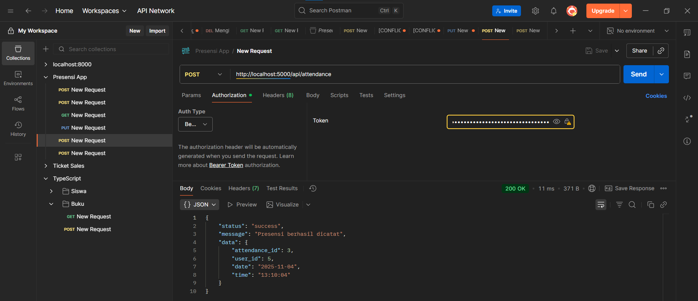

saya membuat projek ini sebagai bentuk persiapan saya terhadap ukl yang akan datang, disini saya juga berdiskusi dengan teman-teman saya untuk mengerjakan projek ini

saya diajari untuk menjalankan perintah saat membuat folder dll, tapi sebagian besar file dan folder saya buat secara manual, karena menurut saya, untuk saat ini saya masih agak bingung dengan penggunaan perintah terminal

jadi saya telah membuat beberapa fitur yang telah diperintahkan oleh guru,

jadi saya sudah membuat db.js atau bisa dibilang databse yang berfungsi untuk menghubungkan koding saya ke databse yang telah saya buat di phpmyadmin, lalu juga controller yang berisi fungsi yang menentukan apa yang akan dilakukan ketika user mengirimkan request tertentu seperti get, post, dll. lalu saya juga membuat middleware yang memisahkan hak akses dari role admin dan user, ada juga routes yang dimana seperti namanya yaitu hal yang mengatur jalan yang memanggil controller sesuai dengan permintaan user, dan ada juga app dan server sebagai file utama yang menggabung dan menjalankannya

Bukti Postman
